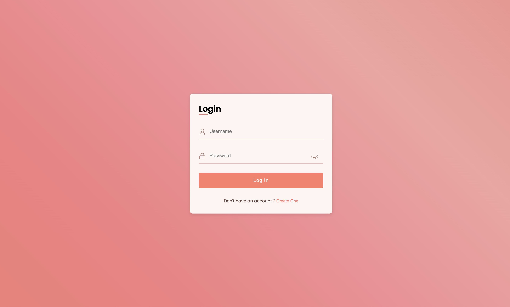

# MeChat

MeChat is a real-time chat application built with the MERN stack and Socket.IO. It enables users to communicate instantly, manage group chats, update profiles, and share media, providing a seamless and interactive messaging experience.

---

## Table of Contents

* [1. Project Overview](#1-project-overview)
* [2. Features](#2-features)
* [3. Tech Stack](#3-tech-stack)
* [4. Setup Instructions](#4-setup-instructions)

  * [Prerequisites](#prerequisites)
  * [1. Clone the Repository](#1-clone-the-repository)
  * [2. Configure Environment Variables](#2-configure-environment-variables)
  * [3. Install Dependencies](#3-install-dependencies)
  * [4. Start the Application](#4-start-the-application)
  * [5. Access the App](#5-access-the-app)
* [5. Screenshots](#5-screenshots)
* [6. Development Notes](#6-development-notes)
* [7. Contributing Guide](#7-contributing-guide)
* [8. License](#8-license)

---

## 1. Project Overview

MeChat is designed to solve the problem of real-time, secure, and user-friendly communication. It supports both one-on-one and group conversations, allowing users to register, authenticate, and chat instantly. The app is suitable for teams, friends, or any group needing fast, reliable messaging.

---

## 2. Features

- **Real-time Messaging:** Instant message delivery using Socket.IO.
- **User Authentication:** Secure registration and login with JWT.
- **Group Chats:** Create, join, and manage group conversations.
- **Message History:** Persistent chat history for all conversations.
- **Media Sharing:** Send images and other media files.
- **Profile Management:** Update user profiles and avatars.
- **Responsive UI:** Modern, mobile-friendly interface.
- **Notifications:** Real-time notifications for new messages and group activity.

---

## 3. Tech Stack

**Backend (Located in `/server`):**
- Node.js
- Express.js
- MongoDB & Mongoose
- Socket.IO
- JWT (jsonwebtoken)
- Multer (file uploads)
- dotenv, config, cors, bcrypt

**Frontend (Located in `/public`):**
- React
- React Router DOM
- Socket.IO Client
- Axios
- SCSS (Sass)
- Emoji Picker React
- React Toastify
- React Icons

**Dev Tools:**
- Nodemon (backend)
- Gulp, Browser Sync (frontend)
- Create React App (frontend bootstrap)

---

## 4. Setup Instructions

### Prerequisites

- Node.js (v14+ recommended)
- npm or yarn
- MongoDB instance (local or cloud)

### 1. Clone the Repository

```bash
git clone https://github.com/Ash-the-k/MeChat.git
cd MeChat
```

### 2. Configure Environment Variables

#### Backend (`server/.env`)

Create a `.env` file in the `server` directory with the following variables:

```env
MONGO_URI=your_mongodb_connection_string
JWT_SECRET=your_jwt_secret
PORT=5000
```

- `MONGO_URI`: MongoDB connection string.
   eg.
   - Use mongodb+srv://... if you're connecting to a MongoDB Atlas (cloud) instance.
   - Use mongodb://127.0.0.1:27017/mechat if you're using MongoDB locally with Compass.
- `JWT_SECRET`: Secret key for JWT authentication
- `PORT`: Port for backend server (default: 5000)


#### Frontend (`public/.env`)

Create a `.env` file in the `public` directory with:

```env
REACT_APP_LOCALHOST_KEY = "chat-app-user";
REACT_APP_PROFILE_PICS_PATHS = "http://localhost:5000/images/profile_pictures/"
REACT_APP_ATTACHMENT_PATHS = "http://localhost:5000/images/attachments/"

REACT_APP_API_URL=http://localhost:5000
```

- `REACT_APP_API_URL`: The base URL for backend API requests

### 3. Install Dependencies

**You will need two terminals: one for the backend, one for the frontend.**

#### Terminal 1: Backend

```bash
cd server
npm install
```

#### Terminal 2: Frontend

```bash
cd public
npm install
```

### 4. Start the Application

**Use the two terminal created to start.**

#### Terminal 1: Start Backend

```bash
npm start
```

- Runs on `http://localhost:5000` by default.

#### Terminal 2: Start Frontend

```bash
npm start
```

- Runs on `http://localhost:3000` by default.

### 5. Access the App

Open your browser and go to: [http://localhost:3000](http://localhost:3000)

---

## 5. Screenshots



*Login screen where users enter credentials*


*Main chat interface with contacts and messages*


*Chat window with an open conversation and message thread*


*Group chat creation modal*


*Profile update screen*

---

## 6. Development Notes

- **Folder Structure:**
  - `/server`: Backend API, authentication, database models, and Socket.IO server.
  - `/public`: React frontend, UI components, and static assets.
- **API Endpoints:** All backend API routes are prefixed with `/api/` (e.g., `/api/auth`, `/api/messages`, `/api/chats`).
- **WebSocket:** Socket.IO is initialized on the backend and connects from the frontend for real-time features.

---

## 7. Contributing Guide

Contributions are welcome! To contribute:

1. Fork the repository.
2. Create a new branch for your feature or bugfix.
3. Commit your changes with clear messages.
4. Open a pull request describing your changes.

Please follow the existing code style and add tests where appropriate.

---

## 8. License

This project is currently unlicensed. All rights are reserved.


